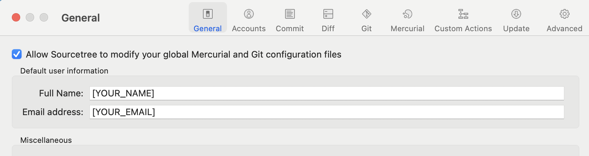

# Git basic


## Configure Git
```
git config --global user.name "[YOUR_NAME]"
git config --global user.email "[YOUR_EMAIL]"
```




## Git Workflow


https://dev.to/mollynem/git-github--workflow-fundamentals-5496


### 0. Initialize Git

```
git init
```

### 1. Add files to staging area
```
git add [file_name]
git add .
git add --all
git add -A
```
